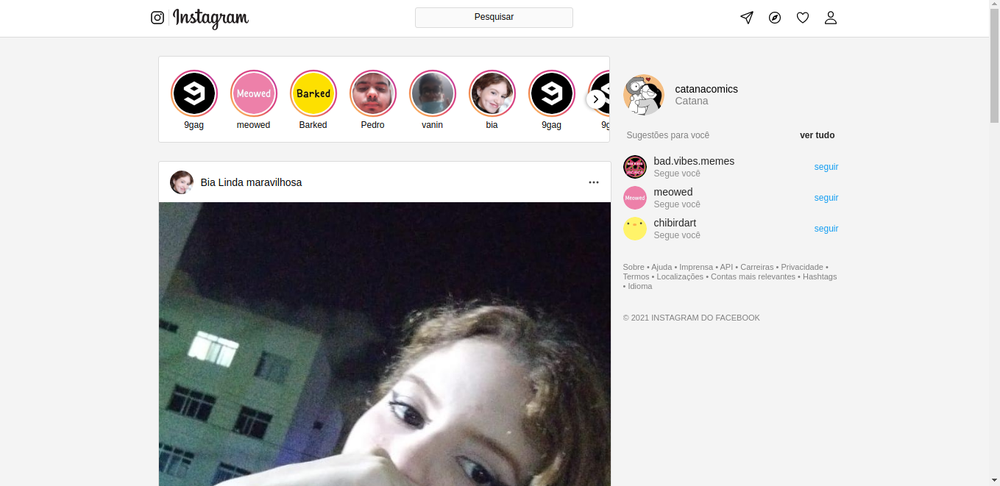
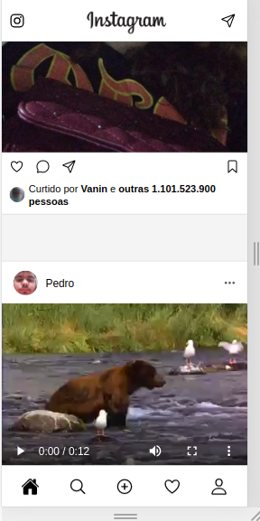

# Instagram Clone

clone responsívo do feed do instagram, vale salientar que a cópia é uma versão aproximada. Foram utilizadas para o projeto HTML e CSS puros. Foram criados um total de 3 versões para diferentes tamanahos de telas usando CSS resposível(media query).

-   **como ficou? segue os prints**!

